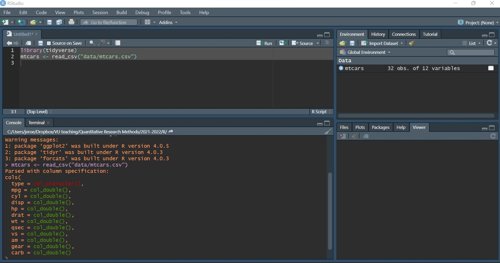

layout: page
title: "R Workshop"
permalink: /getting-started

---
title: "`R` Workshop"
author: ''
date: ''
output:
  html_document:
    df_print: paged
---

```{r setup, include=FALSE}
knitr::opts_chunk$set(echo = TRUE)
setwd("C:/Users/jeroe/Dropbox/VU teaching/Quantitative Research Methods/2021-2022/R/")
```
*This document shows the different steps you need to take to get started with `R`. Please follow them carefully* **before** *coming to class. I presume that you have everything installed and understand everything explained here by the start of the workshop as I will not spend any time on this during class. Note that this workshop will focus on the tools to get you started with your research, not on a comprehensive overview of all the possibilities of the software. When you understand these basics, you can learn at your own pace through a process of trial and error when you work with your own data, similar to learning a new language. Therefore it is important that you read the "Getting help" section as typically most of your problems can be resolved through a simple online search. *


## 0. Why `R`?
If you are still doubting whether to learn `R` for your (quantitative) research, allow me to list a couple of its strenghts: 

1. `R` is free and open source - saving you money
2. `R` is very flexible and powerful - adaptable to nearly any task, e.g., data cleaning, data visualization, econometrics, spatial data analysis, machine learning, web scraping, ... (in fact, this document was made with `R`)
3. `R` is designed to make data handling and analyses transparent and reproducible. A key requirement for solid science!
4. `R` has a vibrant, thriving online community that will (almost) always have a solution to your problem.


## 1. Installing `R` and `RStudio`

To get started with `R`, you need two things: `R`, the actual programming language, and `RStudio`, a popular interface to `R` which allows you to work efficiently and with greater ease with `R`. Both `R` and `RStudio` are free and easy to download. 

Instructions on how to download and install `R` and `RStudio` for Windows, Mac, and Linux can be found here:  <https://rstudio-education.github.io/hopr/starting.html>

## 2. Starting `R` and `RStudio`

A key difference for you to understand is the one between `R`, the actual programming language, and `RStudio`.

The best way to appreciate the value of `RStudio` is to start using `R` *without* `RStudio`. To do this, double-click on the `R` GUI that you should have downloaded on your computer following the steps above (on Windows or Mac), or start `R` in your terminal (on Linux or Mac) by just typing `R` in a terminal, see figure \ref{fig:r console}. You've just opened the `R` **console** which allows you to start typing code right after the `>` sign, called *prompt*. Try typing `2 + 2` or `print("Your Name")` and hit the return key. And *voilà*, your first `R` commands!

```{r console, fig.cap="R in a Windows Terminal",fig.align='center',out.width="50%",echo=FALSE}
knitr::include_graphics("images/console.jpg")
```


Typing one command after the other into the console is not very convenient as your analysis becomes more involved. Ideally, we would like to collect all command statements in a file and run them one after the other, automatically. We can do this by writing so-called **script files** or just **scripts**, i.e. simple text files with extension `.R` or `.r` which can be *inserted* (or *sourced*) into an `R` session. `RStudio` makes this process very easy.

Open `RStudio` by clicking on the `RStudio` application on your computer, and notice how different the whole environment is from the basic `R` console – in fact, that *very same* `R` console is running in your bottom left panel. The upper-left panel is a space for you to write scripts – that is to say many lines of codes which you can run when you choose to. To run a single line of code, simply highlight it and hit `Command` + `Return` (Mac) or `Ctrl` + `Enter` (Windows).

As a simple exercise, create a new script and type in the previous lines of code. Then hit `Command` + `Return` (Mac) or `Ctrl` + `Enter` (Windows). You should see the following output: 

```{r}
2+2
print("Jeroen") 
```

> I highly recommend that you use scripts in `RStudio` for everything related to your research
## 3. Installing Necessary Packages

`R` comes with a number of built-in functions and datasets, but one of the main strengths of `R` as an open-source project is its package system. Packages add additional functions and data. Frequently if you want to do something in `R`, and it is not available by default, there is a good chance that there is a package that will fulfill your needs.

To install a package, use the `install.packages()` function. Think of this as buying a recipe book from the store, bringing it home, and putting it on your shelf (i.e., into your library).

The packages we will use to import, clean, and visualize data are all part of the so-called **tidyverse**. The packages in the tidyvesre share a common philosophy of data and `R` programming, and are designed to work together. You can install the complete tidyverse with a single line of code:

```{r, eval = FALSE}
install.packages("tidyverse")
```

Once a package is installed, it must be loaded into your current `R` session before being used. Think of this as taking the book off of the shelf and opening it up to read. You can do this by running the following line of code: 

```{r, message = FALSE, warning = FALSE}
library(tidyverse)
```

Once you close `R`, all the packages are closed and put back on the imaginary shelf. The next time you open `R`, you do not have to install the package again, but you do have to load any packages you intend to use by invoking `library()`.


## 4. Data Types {#data-types}

`R` has a number of basic *data types*. While `R` is not a *strongly typed language* (i.e. you can be agnostic about types most of the times), it is useful to know what data types are available to you:

- Numeric
    - Also known as Double. The default type when dealing with numbers.
    - Examples: `1`, `1.0`, `42.5`
- Integer
    - Examples: `1L`, `2L`, `42L`
- Complex
    - Example: `4 + 2i`
- Logical
    - Two possible values: `TRUE` and `FALSE`
    - You can also use `T` and `F`, but this is *not* recommended.
    - `NA` is also considered logical.
- Character
    - Examples: `"a"`, `"Statistics"`, `"1 plus 2."`
- Categorical or `factor`
    - A mixture of integer and character. A `factor` variable assigns a label to a numeric value.
    - For example `factor(x=c(0,1),labels=c("male","female"))` assigns the string *male* to the numeric values `0`, and the string *female* to the value `1`. 
    
## 5. Data Frames
The most common way to store and interact with data in `R` is via a `data.frame`. A `data.frame` is a powerful two-dimensional object made up of rows and columns. The nice thing of data frames is that they can contain a mixture of different types of data. Typically, in a data frame each row corresponds to an individual observation and each column corresponds to a different measured or recorded variable. This setup may be familiar to those of you who use Microsoft Excel to manage and store your data. 

As an example, we create a new `data.frame` called "example_data" which has 10 observations and 3 columns (don't worry if you don't understand each line of code): 

```{r}
example_data = data.frame(x = c(1, 3, 5, 7, 9, 1, 3, 5, 7, 9),
                          y = c(rep("Hello", 9), "Goodbye"),
                          z = rep(c(TRUE, FALSE), 5))
```


Let's look at the data frame we just created above:

```{r}
example_data
```

Note that the variable `x` is a **numeric** variable, the variable `y` is a **character**, and the variable `z` has **logical** values. 

## 6. Importing Data

Luckily, you don't have to type in data by hand like we did in the example. By far the most common approach is to create a data frame by importing data from an external file. To do this, you’ll need to have your data correctly formatted and saved in a file format that `R` is able to recognise. Fortunately for us, `R` is able to recognise a wide variety of file formats, although in reality you’ll probably end up only using two or three regularly.

Suppose you have a dataset called "mtcars" with information about different car types stored as a csv file on your computer. Opening the file in Excel would look like this: 

```{r, fig.cap="mtcars data",fig.align='center',out.width="50%",echo=FALSE}

```
Now, we want to import this data into `R`. To do so, we can use the `readr` package which is part of the core `tidyverse`. In particular, we will use the function `read_csv()` which transforms flat csv files into data frames. To import the data, we run the following code: 

```{r, eval=FALSE}
library(tidyverse)
mtcars <- read_csv("data/mtcars.csv")
```
Let's break this down. First, remember that we need to load the *tidyverse* package (which includes *readr*) by using `library(tidyverse)`. Keep in mind that because we had already installed *tidyverse* before we do **not** need to write `install.packages("tidyverse")` first now!

Second, note that inside the `read_csv()` function, we need to specify the **path** of the datafile, i.e. the location where the file is stored. If you want to try this out with your own dataset, replace `"data/mtcars.csv"` with the path of your data. (For Windows users: if you do not know the path, right click on the data file and select "copy path")

Finally, by typing `mtars <-` we tell `R` to store a dataframe called "mtcars" with the values of our dataset. If we would not have done this, `R` would have loaded the data but then simply forget about it. Note that we could have picked any name for our data frame (e.g., we could also have typed `df <- read_csv("data/mtcars.csv")`)

Having done everything correctly, this is what you would see in `RStudio`:

```{r, fig.cap="Importing data with read_csv()",fig.align='center',out.width="70%",echo=FALSE}

```

Note that in the upper right pane you now see under "Data" our new data frame "mtcars" which has 32 observations of 12 variables. 

## 7. Getting Help
To get documentation about a function in `R`, simply put a question mark in front of the function name, or call the function `help(function)` and RStudio will display the documentation, for example: 

```{r, eval = FALSE}
?log
?sin
?paste
?lm
help(lm)   # help() is equivalent
help(ggplot,package="ggplot2")  # show help from a certain package
```

If you get stuck, start with Google. Typically adding "R" to a query is enough to restrict it to relevant results: if the search isn’t useful, it often means that there aren’t any R-specific results available. Google is particularly useful for error messages. If you get an error message and you have no idea what it means, try googling it! Chances are that someone else has been confused by it in the past, and there will be help somewhere on the web. (If the error message isn’t in English, run `Sys.setenv(LANGUAGE = "en")` and re-run the code; you’re more likely to find help for English error messages.)

If Google doesn’t help, try [Stack Overflow](https://stackoverflow.com). Start by spending a little time searching for an existing answer, including [R] to restrict your search to questions and answers that use `R`.


## References
 Wickham, H., & Grolemund, G. (2016). R for data science: import, tidy, transform, visualize, and model data. " O'Reilly Media, Inc.".
 
A free on-line version of this book can be found on: <https://r4ds.had.co.nz/> . In particular, read the following chapters:

* [1 "Introduction"](https://r4ds.had.co.nz/introduction.html)
* [4 "Workflow: basics"](https://r4ds.had.co.nz/workflow-basics.html)
* [6 "Workflow: scripts"](https://r4ds.had.co.nz/workflow-scripts.html)
* [11 "Data import"](https://r4ds.had.co.nz/data-import.html)

