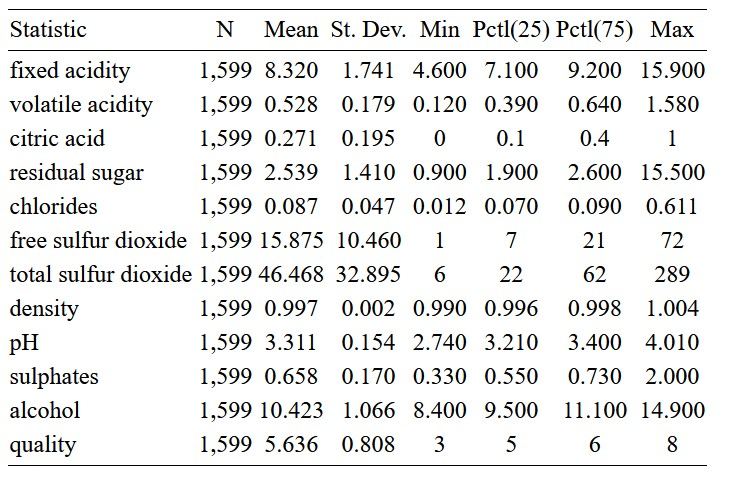
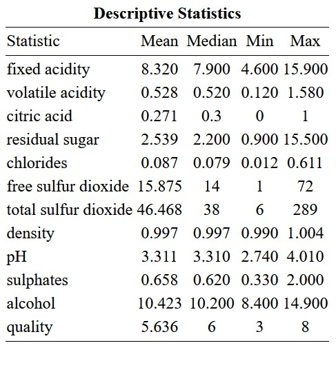
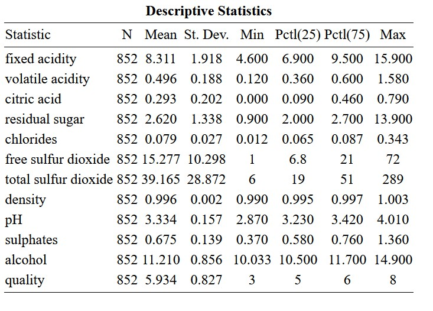

```{r setup, include=FALSE}
options(htmltools.dir.version = FALSE) 
knitr::opts_chunk$set(echo = FALSE, 
                      dev = "svg", 
                      warning = FALSE, 
                      message = FALSE,  
                      fig.align = "center")

theme_metro <- function(x) {
  theme_classic() + 
  theme(panel.background = element_rect(color = '#FAFAFA',fill='#FAFAFA'),
        plot.background = element_rect(color = '#FAFAFA',fill='#FAFAFA'),
        text = element_text(size = 16),
        axis.title.x = element_text(hjust = 1),
        axis.title.y = element_text(hjust = 1, angle = 0))
}
theme_metro_regtitle <- function(x) {
  theme_classic() + 
  theme(panel.background = element_rect(color = '#FAFAFA',fill='#FAFAFA'),
        plot.background = element_rect(color = '#FAFAFA',fill='#FAFAFA'),
        text = element_text(size = 16))
}

library(tidyverse)
library(stargazer)
library(emoji)

wine <- read_csv("data/winequality-red.csv") #import data as dataframe "wine"

library(countdown)
# countdown style
countdown(
  color_border              = "#d90502",
  color_text                = "black",
  color_running_background  = "#d90502",
  color_running_text        = "white",
  color_finished_background = "white",
  color_finished_text       = "#d90502",
  color_finished_border     = "#d90502"
)

```

# The Data Science Pipeline

* Quantitative Research is about numeric `data` 

```{r, echo = F, out.width = "400px"}
knitr::include_graphics("images/data-science-pipeline.png")
```

---

# Cleaning (Tidying) Data

* According a to [2014 NYTimes article](https://www.nytimes.com/2014/08/18/technology/for-big-data-scientists-hurdle-to-insights-is-janitor-work.html), "data scientists [...] spend from ***50 percent to 80 percent of their time*** mired in this more mundane labor of collecting and preparing unruly digital data, before it can be explored for useful nuggets."

* Luckily we have some powerful tools to help us out. 

* Here, we will focus on [`dplyr`](https://dplyr.tidyverse.org) which is part of the [`tidyverse`](https://www.tidyverse.org)

* (When you work with large datasets (+100k rows with many columns) learn to use [`data.table`](https://github.com/Rdatatable/data.table/wiki) which is much faster but has more difficult syntax)

---

# `dplyr` Overview

* You are ***highly encouraged*** to read through [Hadley Wickham's chapter](https://r4ds.had.co.nz/transform.html). It's clear and concise.


* Also check out this great "cheatsheet" [here](https://github.com/rstudio/cheatsheets/blob/master/data-transformation.pdf).


* The package is organized around a set of **verbs**, i.e. *actions* to be taken.


* We operate on `data.frames` or `tibbles` (*nicer looking* data.frames.)

* All *verbs* work as follows:

$$\text{verb}(\underbrace{\text{data.frame}}_{\text{1st argument}}, \underbrace{\text{what to do}}_\text{2nd argument})$$


* Alternatively you can (should) use the `pipe` operator `%>%`:

$$\underbrace{\text{data.frame}}_{\text{1st argument}} \underbrace{\text{ %>% }}_{\text{``pipe" operator}} \text{verb}(\underbrace{\text{what to do}}_\text{2nd argument})$$

---

# Main `dplyr` Verbs

`filter()`: Choose observations based on a certain condition (i.e. subset)


`arrange()`: Reorder rows 


`select()`: Select variables by name


`mutate()`: Create new variables out of existing ones


`summarise()`: Collapse data to a single summary


`group_by()`: All the above can be used in conjunction with `group_by()` to use function on groups rather than entire data

---

# Data: Red Wine Quality 


This dataset contains information about Portuguese "Vinho Verde" wine ([more details](https://www.sciencedirect.com/science/article/abs/pii/S0167923609001377?via%3Dihub) | [download link](https://www.dropbox.com/s/x7hr7a786no4x14/winequality-red.csv?dl=0)). Each row represents one wine sample.

```{r, echo = TRUE}
library(tidyverse)
wine <- read_csv("data/winequality-red.csv") #import data as dataframe "wine"
head(wine[,1:6]) # show first 6 lines of first 6 variables
```

---

# Data: Red Wine Quality


What variables does this dataset contain?

```{r, echo = TRUE}
str(wine)
```

---

# Filtering observations

```r
filter()
```

*Example:* Which wines have at least a alchohol percentage of 10?

---

# `filter`

*Example:* Which wines have at least a alchohol percentage of 10?

```{r, eval=FALSE}
wine %>%
  filter(alcohol > 10) #<<
```

```{r, eval=TRUE, echo = TRUE}
wine %>%
  filter(alcohol > 10)
```

---

# Operators

Standard comparison operators:

- `>` : greater than,
- `<` : smaller than,
- `>=` : greater than or equal to,
- `<=` : smaller than or equal to,
- `!=` : not equal to,
- `==` : equal to.

Logical operators:
1. `x & y`: `x` **and** `y`
1. `x | y`: `x` **or** `y`
1. `!y`: **not** `y`


---

`R` has the convenient `x %in% y` operator (conversely `!x %in% y`), `TRUE` if `x` is *a member of* `y`.
```{r, echo = TRUE}
3 %in% 1:3
c(2,5) %in% 2:10  # also vectorized
c("V","Uni") %in% c("Vrije","Universiteit")  # also strings
```

---

# `filter` with a logical operator

*Example:* Which wines have at least an alchohol percentage of 10 ***and*** a quality score `<` 6?

---

# `filter` with a logical operator

*Example:* Which wines have at least an alchohol percentage of 10 ***and*** a quality score `<` 6?

```{r, eval=FALSE}
wine %>%
  filter(alcohol > 10 & quality < 6) #<<
```

```{r, eval=TRUE, echo = TRUE}
wine %>%
  filter(alcohol > 10 & quality < 6)
```

---

# Creating new variables

```r
mutate()
```

*Example:* What is the total acidity, defined as  `fixed acidity` + `volatile acidity` ?

`r emoji("rotating_light")` Note the use of ` `` ` when you refer to a variable consisting of two or more words. This is quite confusing for inexperienced users. Therefore it is good practice to use one-word variable names (e.g., `fixed_acidity`)

---
# `mutate`

*Example:* What is the total acidity, defined as  `fixed acidity` + `volatile acidity` ? Save the new dataset as  `wine2` 

```{r, eval=TRUE, echo = TRUE}
wine2 <- wine  %>%
  mutate(`total acidity`= `fixed acidity` + `volatile acidity`)

print(wine2[, c('fixed acidity', 'volatile acidity', 'total acidity')])
```

---

# `mutate`

*Example:* Create a new logical variable `low_alcohol` which is `TRUE` if the alcohol percentage `<=` 10

---

# `mutate`

*Example:* Create a new logical variable `low_alcohol` which is `TRUE` if the alcohol percentage `<=` 10. Save the new dataset as  `wine2` 

```{r, eval=TRUE, echo = TRUE}
wine2 <- wine  %>%
  mutate(low_alcohol = (alcohol <= 10))

print(wine2[, c("alcohol", 'low_alcohol')])

```

---

# Summarising variables

```r
summarise()
```

*Example:* What is the mean  `fixed acidity` ?

---

# `summarise`

*Example:* What is the mean  `fixed acidity` ?

```{r, eval=TRUE, echo = TRUE}
wine  %>%
  summarise(`mean acidity`= mean(`fixed acidity`))
```

---

# Summarising variables by group

```r
group_by()
summarise()
```

*Example:* What is the median  `fixed acidity` per `quality` score?

---

# `summarise` with `group_by`

*Example:* What is the median  `fixed acidity` per `quality` score?


```{r, eval=TRUE, echo = TRUE}
wine  %>%
  group_by(quality) %>%
    summarise(`median acidity`= median(`fixed acidity`))
```

---

# Chaining `r emoji("link")` Commands Together

Works for all `dplyr` verbs:

```{r, eval=TRUE, echo = TRUE}
wine  %>%
  mutate(`total acidity`= `fixed acidity` + `volatile acidity`) %>% 
  filter(`total acidity` > 8)

```

---

# Chaining `r emoji("link")`  Commands Together

Works for all `dplyr` verbs:

```{r, eval=TRUE, echo = TRUE}
wine3 <- wine  %>%
            mutate(`total acidity`= `fixed acidity` + `volatile acidity`, 
                    alcohol_hi = alcohol > 10) 
print(wine3[, c('fixed acidity', 'volatile acidity', 'alcohol', 'total acidity', 'alcohol_hi')])
```

---

# Missing Values: `NA`

* Whenever a value is *missing*, we code it as `NA`.
    ```{r, echo = TRUE}
    x <- NA
    ```
* `R` propagates `NA` through operations:
    ```{r, echo = TRUE}
    NA > 5
    NA + 10
    ```
* `is.na(x)` function returns `TRUE` if `x` is an `NA`.
    ```{r, echo = TRUE}
    is.na(x)
    ```

---

# Task 1: Data wrangling

`r countdown(minutes = 10, top = 0)`

Open the `session1_exercises.R` script

1. Which wines have a `quality` of 3 or 6?

2. Create a new variable called `hi_sugar` which is `TRUE` if `residual sugar >= 2 `. Save the new dataset again as 'wine'

3. Calculate the mean chlorides and maximum density by `hi_sugar` group. Use `mean()` and `max()`

---

# Summary statistics with `stargazer` 

The [`stargazer`](https://cran.r-project.org/web/packages/stargazer/stargazer.pdf) package creates well-formattedy summary statistics and regression tables with very little effort in multiple formats.

Using the output table as text (`.txt`) gives a quick view of results. Printing the output table as `.html`, produces tables that can be simply copy-pasted in a Word document.

`r emoji("rotating_light")` `stargazer` works only with `data.frames` not with `tibbles` (I know...). So you have to make sure that your data is in `data.frame` format first


---

``` {css, echo =F} 
    .pull-left {
      float: left;
      width: 30%;
    }

    .pull-right {
      float: right;
     width: 70%;
   }

   .pull-right ~ p {
    clear: both;
   }
```

# Summary statistics with `stargazer` 

.pull-left[
```{r, eval=FALSE, echo = TRUE}
  
library(stargazer)
wine <- as.data.frame(wine)

stargazer(wine, 
          type = 'text')
```
]

.pull-right[ 

```{r, echo = FALSE, eval = TRUE}
  
library(stargazer)
wine <- as.data.frame(wine)

stargazer(wine, 
          type = 'text')
```

]

---

``` {css, echo =F} 
    .pull-left {
      float: left;
      width: 60%;
    }

    .pull-right {
      float: right;
     width: 40%;
   }

   .pull-right ~ p {
    clear: both;
   }
```

# Summary statistics with `stargazer` 

.pull-left[
```{r, eval=FALSE, echo = TRUE}
  
library(stargazer)
wine <- as.data.frame(wine)

stargazer(wine, 
          type = 'html', 
          out='wine_summary.html', 
          title= 'Descriptive Statistics')
```
]

.pull-right[ 

```{r, echo = F, out.width = "400px"}

```

]

---

# Summary statistics with `stargazer`, selected statistics

.pull-left[
```{r, eval=FALSE, echo = TRUE}
  
library(stargazer)
wine <- as.data.frame(wine)

stargazer(wine, 
          type = 'html', 
          out='wine_summary1.html', 
          title= 'Descriptive Statistics', 
          summary.stat = c("mean", "median", "min", "max"))
```
]

.pull-right[ 

```{r, echo = F, out.width = "400px"}

```

]

---

# Summary statistics with `stargazer`, by group 

Although there are other ways, an easy way to obtain statistics by group is to first create a new subset dataframe with `filter()`

.pull-left[
```{r, eval=FALSE, echo = TRUE}

wine_hi_alcohol <- wine %>% 
  filter(alcohol > 10)
  
library(stargazer)
wine_hi_alcohol <- as.data.frame(wine_hi_alcohol)

stargazer(wine_hi_alcohol, 
          type = 'html', 
          out='wine_hi_alcohol-summary.html', 
          title= 'Descriptive Statistics High Alcohol Wines')
```
]

.pull-right[ 

```{r, echo = F, out.width = "400px"}

```

]

---

# Task 2: Summary Statistics

`r countdown(minutes = 5, top = 0)`

Open the `session1_exercises.R` script

1. Calculate the number of number of observations (N), the mean, and standard deviation for all wines with a pH `<=` 3.2

---

# Visualising data with `ggplot2`

One of the strengths of `R` is its ability to create elegant graphs of your data with little effort. 

We will use `ggplot2` one of the core members of the `tidyverse`. I recommend reading the [chapter](https://r4ds.had.co.nz/data-visualisation.html) of Hadley Wickham's book to learn more

The basic syntax of `ggplot2` looks like this: 

```{r, eval=FALSE, echo = TRUE}
ggplot(data = <DATA>)+
  <GEOM_FUNCTION>(mapping = aes(<MAPPINGS>))
```

the geom function is the type of layer you want to add (scatter, line, ...)

the mapping argument defines how variables in your dataset are mapped to visual properties. It is always combined with `aes()`

---

# Making a scatterplot with `ggplot2`

.pull-left[
```{r, echo=TRUE, eval=FALSE}
ggplot(data=wine)+
  geom_point(mapping=aes(x = `fixed acidity`, 
                         y = sulphates))
```
]

.pull-right[
```{r, echo=FALSE, eval=TRUE}
ggplot(data=wine)+
  geom_point(mapping=aes(x = `fixed acidity`, 
                         y = sulphates))
```
]

---

# Making a scatterplot with `ggplot2`

.pull-left[
```{r, echo=TRUE, eval=FALSE}
ggplot(data=wine)+
  geom_point(mapping=aes(x = `fixed acidity`, 
                         y = sulphates, 
                         color = quality))
```
]

.pull-right[
```{r, echo=FALSE, eval=TRUE}
ggplot(data=wine)+
  geom_point(mapping=aes(x = `fixed acidity`, 
                         y = sulphates, 
                         color = quality))
```
]

---

# Making a scatterplot with `ggplot2`

.pull-left[
```{r, echo=TRUE, eval=FALSE}
ggplot(data=wine)+
  geom_point(mapping=aes(x = `fixed acidity`, 
                         y = sulphates, 
                         alpha = quality))
```
]

.pull-right[
```{r, echo=FALSE, eval=TRUE}
ggplot(data=wine)+
  geom_point(mapping=aes(x = `fixed acidity`, 
                         y = sulphates, 
                         alpha = quality))
```
]

---

# Making a barplot with `ggplot2`

.pull-left[
```{r, echo=TRUE, eval=FALSE}
ggplot(data=wine)+
  geom_bar(mapping=aes(x = quality))
```
]

.pull-right[
```{r, echo=FALSE, eval=TRUE}
ggplot(data=wine)+
  geom_bar(mapping=aes(x = quality))
```
]

---

# Making a barplot with `ggplot2`

.pull-left[
```{r, echo=TRUE, eval=FALSE}
ggplot(data=wine)+
  geom_bar(mapping=aes(x = quality), 
           fill = 'blue)
```
]

.pull-right[
```{r, echo=FALSE, eval=TRUE}
ggplot(data=wine)+
  geom_bar(mapping=aes(x = quality), 
           fill = 'blue')
```
]

---

# Making a barplot with `ggplot2`

.pull-left[
```{r, echo=TRUE, eval=FALSE}
ggplot(data=wine)+
  geom_bar(mapping=aes(x = quality), 
           fill = 'blue') +
  labs(title = 'Wine Quality levels',
       x = 'Quality', 
       y = 'Number')
```
]

.pull-right[
```{r, echo=FALSE, eval=TRUE}
ggplot(data=wine)+
  geom_bar(mapping=aes(x = quality), 
           fill = 'blue') +
  labs(title = 'Wine Quality levels',
       x = 'Quality', 
       y = 'Number')
```
]

---

# Task 3: Visualising Data

`r countdown(minutes = 5, top = 0)`

Open the `session1_exercises.R` script

1. Make a scatter plot with `residual sugar` on the x-axis and `alcohol` on the y-axis. Title the graph "Residual sugar by alcohol percentage"

