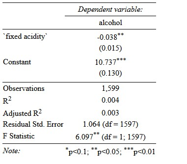

```{r setup, include=FALSE}
options(htmltools.dir.version = FALSE) 
knitr::opts_chunk$set(echo = FALSE, 
                      dev = "svg", 
                      warning = FALSE, 
                      message = FALSE,  
                      fig.align = "center")

theme_metro <- function(x) {
  theme_classic() + 
  theme(panel.background = element_rect(color = '#FAFAFA',fill='#FAFAFA'),
        plot.background = element_rect(color = '#FAFAFA',fill='#FAFAFA'),
        text = element_text(size = 16),
        axis.title.x = element_text(hjust = 1),
        axis.title.y = element_text(hjust = 1, angle = 0))
}
theme_metro_regtitle <- function(x) {
  theme_classic() + 
  theme(panel.background = element_rect(color = '#FAFAFA',fill='#FAFAFA'),
        plot.background = element_rect(color = '#FAFAFA',fill='#FAFAFA'),
        text = element_text(size = 16))
}

library(tidyverse)
library(stargazer)
library(emoji)

wine <- read_csv("data/winequality-red.csv") #import data as dataframe "wine"

library(countdown)
# countdown style
countdown(
  color_border              = "#d90502",
  color_text                = "black",
  color_running_background  = "#d90502",
  color_running_text        = "white",
  color_finished_background = "white",
  color_finished_text       = "#d90502",
  color_finished_border     = "#d90502"
)

```

# Today - Linear Regression and OLS

* I assume you know the theory behind linear regression and ***Ordinary Least Squares (OLS)*** (OLS)

* Here, we will focus on estimating and reporting linear models using OLS

---

# The Relationship between Fixed Acidity and Alcohol

.pull-left[
```{r, echo=TRUE, eval=FALSE}
ggplot(data=wine)+
  geom_point(mapping=aes(x = `fixed acidity`, 
                         y = alcohol)) +
  labs(title = "Alcohol by Fixed Acidity",
       x = "Fixed Acidity", 
       y = "Alcohol")
```
]

.pull-right[
```{r, echo=FALSE, eval=TRUE}
ggplot(data=wine)+
  geom_point(mapping=aes(x = `fixed acidity`, 
                         y = alcohol)) +
  labs(title = 'Alcohol by Fixed Acidity',
       x = 'Fixed Acidity', 
       y = 'Alcohol')
```
]

---

# The Relationship between Fixed Acidity and Alcohol

* Seems like these two variables are negatively related

* Let's check by computing the mean alcohol level for each value of fixed acidity

.pull-left[
```{r, echo=TRUE, eval=FALSE}
acidity_avg_alcohol <- wine %>%
  group_by(`fixed acidity`) %>%
  summarise(avg_alcohol = mean(alcohol))

ggplot(data=acidity_avg_alcohol)+
  geom_point(mapping=aes(x = `fixed acidity`, 
                         y = avg_alcohol)) +
  labs(title = 'Mean Alcohol by Fixed Acidity',
       x = 'Fixed Acidity', 
       y = 'Mean Alcohol')

```
]

.pull-right[
```{r, echo=FALSE, eval=TRUE, fig.height=6}
acidity_avg_alcohol <- wine %>%
  group_by(`fixed acidity`) %>%
  summarise(avg_alcohol = mean(alcohol))

g_alco_acid <- ggplot(data=acidity_avg_alcohol)+
  geom_point(mapping=aes(x = `fixed acidity`, 
                         y = avg_alcohol)) +
  labs(title = 'Mean Alcohol by Fixed Acidity',
       x = 'Fixed Acidity', 
       y = 'Mean Alcohol')

```
]
---

#Fixed Acidity and Alcohol: Regression Line

* Instead of showing the mean of alcohol for all levels of fixed acidity, we can assume their underlying relationship is represented by a *shape*

* Enter *regression* aka *line-fitting*

* In basic forms of regression, this will be a *straight* line

* The equation for such a line with an intercept $b_0$ and a slope $b_1$ is:
    $$
    \widehat{y}_i = b\_0 + b\_1 x\_i
    $$

  * an __outcome variable__ (also called __dependent variable__):  
  *average alcohol* $(y)$
  
  * an __explanatory variable__ (also called __independent variable__ or __regressor__):  
  *fixed acidity* $(x)$

---

# Fixed Acidity and Alcohol: Regression Line

.pull-left[
```{r, echo=FALSE, eval=TRUE}
ggplot(data=wine)+
  geom_point(mapping=aes(x = `fixed acidity`, 
                         y = alcohol)) +
  labs(title = 'Alcohol by Fixed Acidity',
       x = 'Fixed Acidity', 
       y = 'Alcohol') +
   geom_hline(yintercept = 11, col = "#d90502")
  
```
]

.pull-right[

* A *line*! Great. But **which** line? This one?

* That's a *flat* line. But average alcohol is somewhat *decreasing* with fixed acidity `r emoji("weary")`

* We need a rule to decide!

]

---

# Ordinary Least Squares (OLS)

* OLS gives us the line that minimizes *the sum of the squared residuals*

* The residual is the 'error' or * vertical distance* between your line and the actual observation

```{r, echo = FALSE, eval = TRUE, out.extra = 'style="border: none;"'}
knitr::include_url("https://gustavek.shinyapps.io/reg_simple/")

```

---

# **O**rdinary **L**east **S**quares (OLS): Interpretation

For now assume both the dependent variable $(y)$ and the independent variable $(x)$ are numeric.

> Intercept $(b_0)$: **The predicted value of $y$ $(\widehat{y})$ if $x = 0$.**

> Slope $(b_1)$: **The predicted change, on average, in the value of $y$ *associated* to a one-unit increase in $x$.**

* `r emoji("warning")` Note that we use the term *associated*, **clearly avoiding interpreting $b_1$ as the causal impact of $x$ on $y$**. To make such a claim, we need some specific conditions to be met. 

 
* Also notice that the units of $x$ will matter for the interpretation (and magnitude!) of $b_1$.

* **You need to be explicit about what the unit of $x$ is!**

---
# OLS with `R`

* In `R`, OLS regressions are estimated using the `lm` function.

* This is how it works:

  ```{r, echo = TRUE, eval = FALSE}
  lm(formula = dependent variable ~  independent variable, data = data.frame containing the data)
  ```

## Alcohol and Fixed Acidity

Let's estimate the following model by OLS: $\textrm{alcohol}_i = b_0 + b_1 \textrm{fixed acidity}_i + e_i$

.pull-left[
```{r echo=T, eval = FALSE}
# OLS regression of alcohol on fixed acidity
lm(alcohol ~ `fixed acidity`, wine) 
```
]

.pull-right[
```{r echo=F, eval = TRUE}
# OLS regression of alcohol on fixed acidity
lm(alcohol ~ `fixed acidity`, wine) 
```
]

---

# **O**rdinary **L**east **S**quares (OLS): Prediction

```{r echo=F, eval = TRUE}
# OLS regression of alcohol on fixed acidity
lm(alcohol ~ `fixed acidity`, wine) 
```

This implies (abstracting the $_i$ subscript for simplicity):


$$
\begin{aligned}
\widehat y &= b_0 + b_1 x \\
\widehat {\text{alcohol}} &= b_0 + b_1 \cdot \text{fixed acidity} \\
\widehat {\text{alcohol}} &=  10.73701 + (-0.03775) \cdot \text{fixed acidity}
\end{aligned}
$$

What's the predicted level of alcohol for a wine with an acidity of 10? (Using the *exact* coefficients.)

$$
\begin{aligned}
\widehat {\text{average math score}} &= 10.73701 + (-0.03775) \cdot 10 \\
\widehat {\text{average math score}} &= 10.35951
\end{aligned}
$$

---
# Task 1: Simple OLS Regression

`r countdown(minutes = 5, top = 0)`

1. Regress `pH` on `residual sugar` (so `pH` is the *dependent* variable)

1. Using the exact coefficients, calculate the predicted pH value when residual sugar = 2

---

# Exporting Regression Output with Stargazer

* We can again use `stargazer` to create publication-ready regression tables
.pull-left[
```{r echo=TRUE, eval = FALSE}
# OLS regression of alcohol on fixed acidity
reg <- lm(alcohol ~ `fixed acidity`, wine) 
stargazer(reg, 
          out = "regression.html",
          type = "html")
```
]

.pull-right[
```{r figure.height=6}

```
]

---
# Task 2: Exporting Simple Regression Output

`r countdown(minutes = 5, top = 1)`

1. Regress `pH` on `residual sugar` (so `pH` is the *dependent* variable) and assign the output to an object with a name you prefer. Export the output to an html file using the `stargazer` function

---
# Multiple Regression 

* The prior examples only had one predictor. However, you can easily add more to your model. 

* This may be necessary when you need to control for confounding factors

* Or when you want to test for interaction (moderating) effects, including polynomials

---

# Alcohol and Fixed Acidity: Controlling for Density

Let's estimate the following model by OLS:
$\textrm{alcohol}_i = b_0 + b_1 \textrm{fixed acidity}_i  + b_2 \textrm{density}_i + e_i$


```{r echo=T, eval = T}
# OLS regression of alcohol on fixed acidity
lm(alcohol ~ `fixed acidity` + density, wine) 
```

---

# Alcohol and Fixed Acidity: Interacting with Density

Let's estimate the following model by OLS:

$\textrm{alcohol}_i = b_0 + b_1 \textrm{fixed acidity}_i  + b_2 \textrm{density}_i + b_3 \textrm{fixed acidity} \cdot \textrm{density}_i + e_i$


```{r echo=T, eval = T}
# OLS regression of alcohol on fixed acidity
lm(alcohol ~ `fixed acidity`*density, wine) 
```

---

# Task 3: Multiple Regression

`r countdown(minutes = 5, top = 1)`

1. Regress `quality` on `alcohol`, `sulphates`, their interaction, and control for `chlorides`

2. Export the output using `stargazer`

